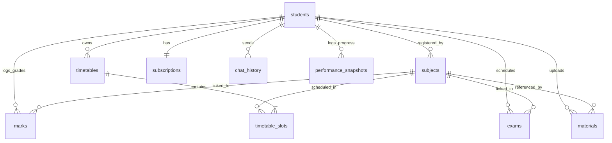

# AI Study Planner - Database ER Map

This document outlines the entity-relationship schema of the PostgreSQL database hosted on Supabase, mapped to Hibernate/JPA annotations.

---

## 1. ER Diagram

---

## 2. Table Definitions

### 2.1. `students` Table
- **JPA Class:** `com.aistudyplanner.model.entity.Student`
- **Columns:**
  - `id` (UUID, Primary Key, Auto-generated)
  - `firebase_uid` (VARCHAR(128), Unique, Not Null) - Firebase authentication unique user key
  - `phone_number` (VARCHAR(20), Unique, Nullable)
  - `full_name` (VARCHAR(100), Nullable)
  - `email` (VARCHAR(150), Nullable)
  - `college_name` (VARCHAR(200), Nullable)
  - `semester` (INTEGER, Nullable)
  - `department` (VARCHAR(100), Nullable)
  - `available_hours_per_day` (NUMERIC(4, 1), Default 4.0)
  - `is_premium` (BOOLEAN, Default False)
  - `email_notifications` (BOOLEAN, Default True)
  - `push_notifications` (BOOLEAN, Default False)
  - `study_streak` (INTEGER, Default 0)
  - `last_active_date` (DATE, Nullable)
  - `profile_picture_url` (TEXT, Nullable)
  - `created_at` (TIMESTAMPTZ, Auto-filled on insert)
  - `updated_at` (TIMESTAMPTZ, Auto-updated)

---

### 2.2. `subjects` Table
- **JPA Class:** `com.aistudyplanner.model.entity.Subject`
- **Columns:**
  - `id` (UUID, Primary Key, Auto-generated)
  - `student_id` (UUID, Foreign Key referencing `students(id)`, ON DELETE CASCADE, Not Null)
  - `subject_name` (VARCHAR(100), Not Null)
  - `subject_code` (VARCHAR(20), Nullable)
  - `credits` (INTEGER, Nullable)
  - `difficulty_level` (INTEGER, Default 3)
  - `semester` (INTEGER, Nullable)
  - `created_at` (TIMESTAMPTZ)

---

### 2.3. `exams` Table
- **JPA Class:** `com.aistudyplanner.model.entity.Exam`
- **Columns:**
  - `id` (UUID, Primary Key, Auto-generated)
  - `student_id` (UUID, Foreign Key referencing `students(id)`, ON DELETE CASCADE, Not Null)
  - `subject_id` (UUID, Foreign Key referencing `subjects(id)`, ON DELETE CASCADE, Not Null)
  - `exam_name` (VARCHAR(100), Nullable)
  - `exam_date` (DATE, Not Null)
  - `exam_type` (VARCHAR(50), Nullable)
  - `duration_hours` (NUMERIC(4, 1), Nullable)
  - `syllabus_covered` (TEXT, Nullable)
  - `is_completed` (BOOLEAN, Default False)
  - `created_at` (TIMESTAMPTZ)
- **Indices:**
  - `idx_exam_student_date` on `(student_id, exam_date)`
  - `idx_exam_date` on `(exam_date)`

---

### 2.4. `marks` Table
- **JPA Class:** `com.aistudyplanner.model.entity.Marks`
- **Columns:**
  - `id` (UUID, Primary Key, Auto-generated)
  - `student_id` (UUID, Foreign Key referencing `students(id)`, ON DELETE CASCADE, Not Null)
  - `subject_id` (UUID, Foreign Key referencing `subjects(id)`, ON DELETE CASCADE, Not Null)
  - `exam_type` (VARCHAR(50), Enum) - e.g. quiz, midterm, semester
  - `marks_obtained` (NUMERIC(6, 2), Nullable)
  - `total_marks` (NUMERIC(6, 2), Nullable)
  - `percentage` (NUMERIC(5, 2), Auto-calculated via `@PrePersist` / `@PreUpdate`)
  - `exam_date` (DATE, Nullable)
  - `created_at` (TIMESTAMPTZ)
- **Indices:**
  - `idx_marks_student` on `(student_id)`
  - `idx_marks_subject` on `(subject_id)`
  - `idx_marks_student_subject` on `(student_id, subject_id)`

---

### 2.5. `timetables` Table
- **JPA Class:** `com.aistudyplanner.model.entity.Timetable`
- **Columns:**
  - `id` (UUID, Primary Key, Auto-generated)
  - `student_id` (UUID, Foreign Key referencing `students(id)`, ON DELETE CASCADE, Not Null)
  - `title` (VARCHAR(100), Nullable)
  - `week_start_date` (DATE, Nullable)
  - `is_ai_generated` (BOOLEAN, Default True)
  - `is_active` (BOOLEAN, Default True) - Marks if this is the active visible timetable
  - `created_at` (TIMESTAMPTZ)

---

### 2.6. `timetable_slots` Table
- **JPA Class:** `com.aistudyplanner.model.entity.TimetableSlot`
- **Columns:**
  - `id` (UUID, Primary Key, Auto-generated)
  - `timetable_id` (UUID, Foreign Key referencing `timetables(id)`, ON DELETE CASCADE, Not Null)
  - `subject_id` (UUID, Foreign Key referencing `subjects(id)`, ON DELETE CASCADE, Not Null)
  - `day_of_week` (INTEGER, Not Null) - 0 (Monday) through 6 (Sunday)
  - `start_time` (TIME, Not Null)
  - `end_time` (TIME, Not Null)
  - `topic` (VARCHAR(200), Nullable) - Injected AI topic suggestion
  - `is_completed` (BOOLEAN, Default False)
  - `notes` (TEXT, Nullable)
  - `created_at` (TIMESTAMPTZ)

---

### 2.7. `subscriptions` Table
- **JPA Class:** `com.aistudyplanner.model.entity.Subscription`
- **Columns:**
  - `id` (UUID, Primary Key, Auto-generated)
  - `version` (BIGINT) - Optimistic locking field
  - `student_id` (UUID, Foreign Key referencing `students(id)`, UNIQUE, ON DELETE CASCADE, Not Null)
  - `plan_type` (VARCHAR(50), Enum) - e.g. `FREE`, `PREMIUM_MONTHLY`, `PREMIUM_YEARLY`
  - `razorpay_order_id` (VARCHAR(100), Nullable)
  - `razorpay_payment_id` (VARCHAR(100), Nullable)
  - `razorpay_subscription_id` (VARCHAR(100), Nullable)
  - `amount_paise` (INTEGER, Nullable)
  - `currency` (VARCHAR(10), Default 'INR')
  - `status` (VARCHAR(30), Enum) - e.g. `CREATED`, `PAID`, `FAILED`, `CANCELLED`
  - `started_at` (TIMESTAMPTZ, Nullable)
  - `expires_at` (TIMESTAMPTZ, Nullable)
  - `created_at` (TIMESTAMPTZ)

---

### 2.8. `materials` Table
- **JPA Class:** `com.aistudyplanner.model.entity.Material`
- **Columns:**
  - `id` (UUID, Primary Key, Auto-generated)
  - `student_id` (UUID, Foreign Key referencing `students(id)`, ON DELETE CASCADE, Not Null)
  - `subject_id` (UUID, Foreign Key referencing `subjects(id)`, ON DELETE SET NULL, Nullable)
  - `title` (VARCHAR(200), Nullable)
  - `file_name` (VARCHAR(255), Nullable)
  - `file_url` (TEXT, Nullable)
  - `file_type` (VARCHAR(50), Nullable)
  - `material_type` (VARCHAR(50), Enum)
  - `file_size_bytes` (BIGINT, Nullable)
  - `ai_summary` (TEXT, Nullable)
  - `ai_categorized_subject` (VARCHAR(100), Nullable)
  - `created_at` (TIMESTAMPTZ)

---

### 2.9. `chat_history` Table
- **JPA Class:** `com.aistudyplanner.model.entity.ChatHistory`
- **Columns:**
  - `id` (UUID, Primary Key, Auto-generated)
  - `student_id` (UUID, Foreign Key referencing `students(id)`, ON DELETE CASCADE, Not Null)
  - `session_id` (VARCHAR(100), Nullable) - Chat room identifier
  - `role` (VARCHAR(20), Nullable) - 'user' or 'assistant'
  - `message` (TEXT, Nullable)
  - `created_at` (TIMESTAMPTZ)

---

### 2.10. `performance_snapshots` Table
- **JPA Class:** `com.aistudyplanner.model.entity.PerformanceSnapshot`
- **Columns:**
  - `id` (UUID, Primary Key, Auto-generated)
  - `student_id` (UUID, Foreign Key referencing `students(id)`, ON DELETE CASCADE, Not Null)
  - `snapshot_date` (DATE, Nullable)
  - `overall_percentage` (NUMERIC(5, 2), Nullable)
  - `study_hours_week` (NUMERIC(5, 1), Nullable)
  - `tasks_completed` (INTEGER, Nullable)
  - `ai_recommendations` (TEXT, Nullable)
  - `created_at` (TIMESTAMPTZ)
