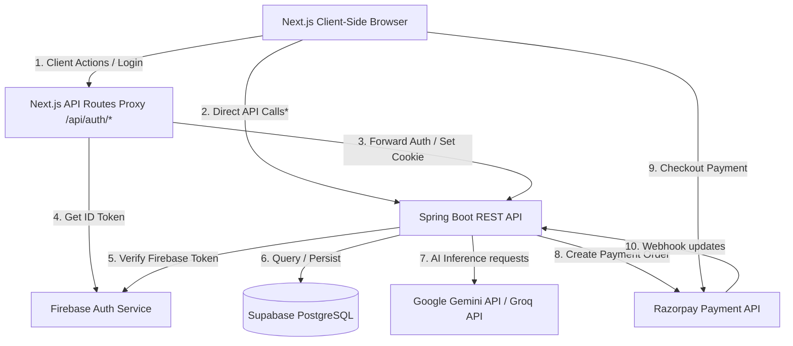

# AI Study Planner - Project Architecture

This document details the software architecture, tech stack, data flow, security model, and external integrations of the AI Study Planner monorepo.

---

## 1. High-Level Architecture
The application is structured as a full-stack web application with a decoupled Next.js frontend and a Java Spring Boot backend, utilizing a Supabase PostgreSQL database.

---

## 2. Technology Stack

### Frontend (Next.js App)
- **Core Framework:** Next.js 15+ (App Router)
- **State Management:** Zustand (with persist middleware for state synchronization)
- **Data Fetching & Cache:** TanStack React Query (v5)
- **Styling:** Vanilla CSS (Tailwind CSS configured but Vanilla CSS preferred for custom cards/onboarding animations)
- **HTTP Client:** Axios (configured with credentials support)
- **Auth Provider:** Firebase Client SDK

### Backend (Spring Boot App)
- **Core Framework:** Spring Boot 3.3.0 / Java 17
- **Database Access:** Spring Data JPA / Hibernate
- **Database Engine:** PostgreSQL (hosted on Supabase)
- **Security:** Spring Security (stateless JWT token filters, custom annotation resolvers)
- **HTTP Client:** RestTemplate (for Groq/Gemini and Razorpay API calls)
- **Caching:** Spring Boot Cache Starter (with local cache provider)

### Infrastructure & External Services
- **Firebase Auth:** Handles user signup, email verification, Google Sign-in, and JWT session issuing.
- **Supabase:** Hosts the relational PostgreSQL instance and handles connection pooling.
- **Razorpay:** Manages payment order creation, webhook notification handling, and payment verification.
- **Google Gemini API (called GroqService):** Used for AI study recommendations, material summarization, chat history responses, and document categorization.

---

## 3. Client-Server Mismatch & Authentication Flow

### The Mismatch Discovery
A critical architectural conflict exists between the frontend and backend domains:
1. **Frontend Host:** `https://ai-study-planner-jhh9.vercel.app`
2. **Backend Host:** `https://ai-study-planner-hp0e.onrender.com`
3. **The Proxy:** The frontend Next.js App Router includes a catch-all route handler at `/api/auth/[...path]/route.ts`. This proxy reads the `access_token` cookie from the Vercel domain and forwards it to the Render backend in the `Authorization: Bearer <token>` header.
4. **The Client Call Mismatch:** The client-side Axios client (`apiClient.ts`) uses `ENV.BACKEND_URL` as its `baseURL` (which defaults to the Render URL). Thus, browser requests (e.g. `apiClient.get('/api/students/me')`) bypass the Vercel proxy and go directly to Render.
5. **CORS & Cookie Restrictions:** Since the browser calls the Render domain directly, it cannot send the `access_token` cookie set on the Vercel domain. Because there is no request interceptor to append the JWT, all direct Axios API calls fail with `401 Unauthorized` in production.

### Canonical Authentication Flow
To prevent authentication failures, client-side requests must go through the Vercel API proxy:

1. **Authentication (Login):**
   - User inputs credentials or triggers Google Sign-In.
   - Firebase Client SDK authenticates the user and returns a Firebase ID Token.
   - Frontend calls `POST /api/auth/login` (Next.js route handler) with the Firebase token.
   - Next.js server-side route handler exchanges this token with the backend REST API (`POST /api/auth/login`).
   - The backend validates the Firebase token and returns a custom backend JWT.
   - Next.js route handler sets this JWT as an `httpOnly`, `secure`, `sameSite=strict` cookie named `access_token` on the Vercel domain.
   - The user profile is returned to the client and stored in Zustand.

2. **Authorized API Request (Via Proxy):**
   - Client calls `/api/auth/students/me` (instead of calling Render directly).
   - Vercel Next.js proxy extracts the `access_token` cookie.
   - Proxy appends `Authorization: Bearer <access_token>` header.
   - Proxy forwards request to `${ENV.BACKEND_URL}/api/students/me`.
   - Backend `FirebaseTokenFilter` parses the token and establishes the security context.
   - Backend controller responds to Vercel proxy, which sends the payload back to the browser.

3. **Token Refresh Flow:**
   - On Firebase auth state changes, the client sets `document.cookie` containing the Firebase token (`__session`).
   - If a request returns `401 Unauthorized`, the Axios response interceptor calls `/api/auth/refresh`.
   - Vercel's `/api/auth/refresh` reads the `refresh_token` (Firebase ID Token) and calls the backend `/api/auth/refresh` endpoint.
   - Backend returns a fresh JWT, which the Next.js handler saves back to the `access_token` cookie.
   - Axios retries the original request.
