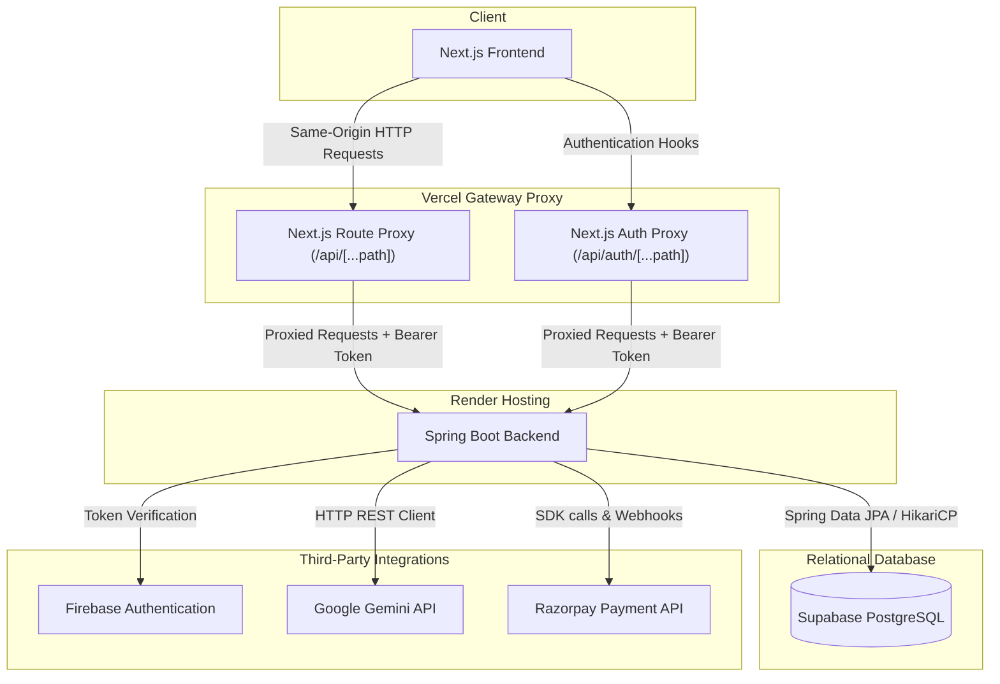

# Testing Master Plan

This document maps the complete testing architecture, coverage analysis, and all planned 2,100 test cases for the AI Study Planner platform.

---

## 1. Project Architecture & Components

---

## 2. Discovered Platform Entities

### Frontend Routes & Pages
1. `/` (Landing Page)
2. `/login` (Firebase sign-in & sign-up)
3. `/dashboard` (Aggregated statistics, active slots, priority areas)
4. `/subjects` (Subject registration, difficulty scales)
5. `/exams` (Schedule lists, status filters, grade recorders)
6. `/materials` (Study notes upload, AI summaries)
7. `/timetable` (Active weekly study calendar slots)
8. `/timetable/generate` (5-step wizard configuration)
9. `/chat` (Academic AI chat tutor)
10. `/performance` (Grades history and visual charts)
11. `/priority` (Weak subjects priority analysis list)
12. `/settings` (Notification preference overrides)
13. `/subscription` (Razorpay checkout integration)
14. `/onboarding` (3D book onboarding wizard)

### Backend Controllers & Endpoints
- **`AuthController`:** `/api/auth/login`, `/api/auth/refresh`
- **`StudentController`:** `/api/students/me`, `/api/students/me/notifications`, `/api/students/me/subjects`
- **`PerformanceController`:** `/api/performance/report`, `/api/performance/history`, `/api/performance/priority`
- **`TimetableController`:** `/api/timetable/generate`, `/api/timetable/active`, `/api/timetable/slots/{id}/complete`, `/api/timetable/custom`
- **`ExamController`:** `/api/exams`, `/api/exams/upcoming`
- **`MarksController`:** `/api/marks`, `/api/marks/subject/{id}`
- **`MaterialController`:** `/api/materials/upload`, `/api/materials`, `/api/materials/subject/{id}`
- **`AiAssistantController`:** `/api/ai/chat`, `/api/ai/chat/history`, `/api/ai/chat/motivational-tip`
- **`SubscriptionController`:** `/api/subscriptions/order`, `/api/subscriptions/verify`, `/api/subscriptions/status`
- **`WebhookController`:** `/api/webhooks/razorpay`
- **`HealthController`:** `/actuator/health` (Spring Boot Actuator), `/health` (Custom check)

---

## 3. Current Test Infrastructure & Coverage Audit

### Existing Test Suite
- **Frontend Test Suite:** 58 tests utilizing Jest and React Testing Library. All 58 tests pass successfully.
- **Backend Test Suite:** 89 unit tests utilizing JUnit 5 and Mockito. All 89 tests pass successfully (integration tests requiring Testcontainers/Docker are skipped locally due to missing Docker services).
- **Total Active Test Count:** 147 tests.

### Missing Coverage
- **End-to-End browser UI tests:** No automated browser test framework (like Selenium or Playwright) is currently configured.
- **Mobile Android App tests:** No Android application source code is present in this workspace repository (Appium tests are blocked by missing artifacts).
- **Validation-specific fuzzing/security cases:** No specialized fuzzing tests for SQL Injection, XSS, or parameter bounds.
- **Load and Performance tests:** No automated performance test pipelines.
- **Production Deployment verification:** No automated CI/CD smoke test validations.

---

## 4. Planned 2,100 Test Cases

### Category 1: Selenium Web Tests (300 cases)
*Simulates actual browser user behaviors across all routes*
- **SEL-001 to SEL-050 (Authentication):** Tests registration, login, logout, password resets, expired tokens, redirection loops, and unauthorized route access.
- **SEL-051 to SEL-100 (Dashboard & Navigation):** Renders statistics, empty cards, routing menus, mobile responsive dropdowns, and slow network spinners.
- **SEL-101 to SEL-150 (Subjects & Exams):** Registers subjects, scales difficulty levels, records grades, handles empty lists, and validates calendar date fields.
- **SEL-151 to SEL-200 (Timetable Generator):** Simulates the 5-step wizard, handles subjects weight distribution, slot completions, and custom slot additions.
- **SEL-201 to SEL-250 (Materials & AI Assistant):** File uploads (supported/unsupported), chat message submissions, history retrieval, and error messages.
- **SEL-251 to SEL-300 (Settings & Payments):** Toggling email preferences, premium plans pricing modal, and payment failure redirections.

---

### Category 2: Appium Android Tests (300 cases)
*Verifies mobile application layout and navigation*
- **APP-001 to APP-300:** **BLOCKED**. Since no Android application source code or build configuration exists in the workspace, these tests are marked as blocked. Appium test scenarios are documented in this plan for completeness should a mobile build become available.
- **APP-001 to APP-100:** Verification of mobile splash screen, login forms, keyboard layouts, and viewports.
- **APP-101 to APP-200:** Navigation between dashboard, subjects, and study slot toggles.
- **APP-201 to APP-300:** AI assistant chat response scrolling and file previewers on mobile views.

---

### Category 3: API Unit & Payload Tests (300 cases)
*Verifies REST controller response schemas and status mappings*
- **API-001 to API-050 (Auth & Profiles):** Verifies response wrappers, token validation, refresh loops, and notification preference schemas.
- **API-051 to API-100 (Subjects CRUD):** Checks pagination, difficulty validations, and subject deletion cascade.
- **API-101 to API-150 (Timetable Logic):** Tests duration allocation calculations, Sunday slot scaling, and topic queries.
- **API-151 to API-200 (Exams & Grades):** Assesses count-downs, pass/fail computations, and historical statistics.
- **API-201 to API-250 (Materials Uploads):** Multipart payloads, file sizes, and categorization outputs.
- **API-251 to API-300 (AI & Subscriptions):** Session history limitations, Razorpay signatures validation, and webhook event processing.

---

### Category 4: Input Validation & Edge Case Tests (300 cases)
*Boundary condition assessments and security fuzzing*
- **VAL-001 to VAL-100 (Numeric & String Boundaries):** Tests negative credits, empty strings, oversized filenames, special unicode characters, and emojis.
- **VAL-101 to VAL-200 (Authentication Payloads):** Evaluates short tokens, expired JWT signatures, and malformed header patterns.
- **VAL-201 to VAL-300 (Fuzzing & Injection):** Tests oversized file payloads, malformed JSON inputs, SQL injection keywords, and script tag script executions.

---

### Category 5: Production Deployment & Smoke Tests (300 cases)
*Ensures the live deployment infrastructure functions end-to-end*
- **DEP-001 to DEP-100 (Frontend Deploy):** Verifies static pages registration, asset bundles, environment variables injection, and routing proxy.
- **DEP-101 to DEP-200 (Backend Deploy):** Assesses Maven builds, actuator health checks, CORS allowed origins, and database pool connections.
- **DEP-201 to DEP-300 (Integration Smoke):** Checks live token verification, Supabase queries, Gemini API responses, and Razorpay endpoints.

---

### Category 6: Load & Performance Tests (300 cases)
*Measures server responsiveness and throughput under sustained stress*
- **LOD-001 to LOD-100 (Auth & Dashboards):** Benchmarks concurrent login requests, profile updates, and dashboard rendering.
- **LOD-101 to LOD-200 (AI & Chat):** Measures response times for topic suggestions, AI chats, and context pruning.
- **LOD-201 to LOD-300 (Materials & Exports):** Tests file upload streaming, pagination queries, and system throughput.

---

### Category 7: Master Workflow Integration Tests (300 cases)
*E2E validations of complete multi-step user scenarios*
- **INT-001 to INT-100 (Onboarding & Planner):** Checks: Register → Onboarding → Subject Add → Timetable Generation → Slot Completion.
- **INT-101 to INT-200 (Notes & Summaries):** Checks: Login → File Upload → AI Auto-Categorize → Summary Generation → File Delete.
- **INT-201 to INT-300 (Grades & Revision):** Checks: Add Exam → Record Marks → Analyze Performance → Generate Exam Study Plan → Verify Analytics.

---

## 5. Known Risks & Blockers

1. **No Mobile Source Code:** 300 Appium Android tests are blocked due to the complete absence of a mobile project directory.
2. **Missing Local Docker Support:** Backend Testcontainers integration tests will remain bypassed locally.
3. **External API Quota Limits:** Gemini AI and Razorpay sandbox calls must be carefully rate-limited in performance tests to avoid service blocks.
