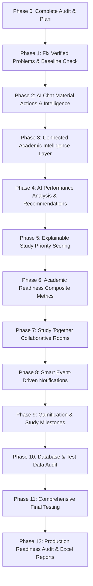

# Implementation Plan: AI Study Planner Enhancements

**Generated:** 2026-08-20  
**Status:** PHASE 0 APPROVED EXECUTION BLUEPRINT  
**Target:** Systematic Execution of Phases 1 through 12  

---

## 1. Safest Implementation Sequence

---

## 2. Detailed Phase-by-Phase Plan

### Phase 1 — Fix Verified Existing Problems & Baseline Verification
- **Goal:** Ensure baseline application is 100% stable before any additive feature work.
- **Files Involved:**
  - `backend/src/test/java/com/aistudyplanner/ManualTokenGenTest.java` (Verified `@Disabled`)
  - `frontend/src/__tests__/app/auth/login.test.tsx` (Verified `fireEvent.submit`)
  - `backend/src/main/java/com/aistudyplanner/service/MaterialService.java`
- **Actions:**
  - Execute `./mvnw.cmd test` (Target: 110/110 passing).
  - Execute `npm test -- --passWithNoTests` (Target: 58/58 passing).
  - Execute `npm run build` (Target: 22/22 routes compiling with 0 errors).
- **Verification:** All tests green, 0 build failures.

---

### Phase 2 — AI Chat Material Attachments & Quick Actions
- **Goal:** Enhance existing AI Chat with rich material actions ("Explain", "Summarize", "Generate MCQs", "Extract Topics", "Generate Flashcards", "Create Study Plan").
- **Files Involved:**
  - `frontend/src/components/chat/ChatInput.tsx`
  - `frontend/src/components/chat/ChatContainer.tsx`
  - `frontend/src/components/chat/chat.module.css`
  - `frontend/src/hooks/useChat.ts`
  - `backend/src/main/java/com/aistudyplanner/service/AiAssistantService.java`
  - `backend/src/main/java/com/aistudyplanner/service/GroqService.java`
- **Actions:**
  - Add quick action prompt chips when an attachment is uploaded in AI Chat (`Summarize`, `Generate MCQs`, `Extract Key Topics`, `Flashcards`, `Study Plan`).
  - Pass intent action into `AiAssistantService.chat` to guide Groq's formatting and output structure.
- **Verification:** Unit tests for chat, test upload of PDF and Image with each action chip.

---

### Phase 3 — Connected Academic Intelligence Layer (Materials + Subjects + Exams + AI)
- **Goal:** Connect student's real data (subjects, weak marks, exam dates, available study hours, uploaded materials) so "What should I study today?" gives grounded, data-backed advice.
- **Files Involved:**
  - `backend/src/main/java/com/aistudyplanner/service/AiAssistantService.java`
  - `backend/src/main/java/com/aistudyplanner/service/GroqService.java`
  - `backend/src/main/java/com/aistudyplanner/repository/SubjectRepository.java`
  - `backend/src/main/java/com/aistudyplanner/repository/ExamRepository.java`
  - `backend/src/main/java/com/aistudyplanner/repository/MarksRepository.java`
- **Actions:**
  - In `AiAssistantService.chat`, build dynamic student academic context when the query is study-advice related:
    - Subject list and difficulty levels
    - Low-scoring subjects (<60% average)
    - Upcoming exams within 30 days and countdown
    - Available hours per day
    - Extracted topics from recently uploaded materials
  - Inject context into Groq prompt without hallucinating missing data.
- **Verification:** Test AI chat with queries like "What should I study today?", "How should I prepare for my upcoming exam?".

---

### Phase 4 — AI Performance Analysis & Actionable Insights
- **Goal:** Add "Analyze My Performance" capability to provide subject-level strengths, weaknesses, trends, and recommended study durations based on actual marks.
- **Files Involved:**
  - `backend/src/main/java/com/aistudyplanner/controller/PerformanceController.java`
  - `backend/src/main/java/com/aistudyplanner/service/PerformanceService.java`
  - `backend/src/main/java/com/aistudyplanner/service/GroqService.java`
  - `frontend/src/app/(dashboard)/performance/page.tsx`
  - `frontend/src/api/performance.api.ts`
- **Actions:**
  - Add/enhance `GET /api/performance/ai-analysis` or `POST /api/ai/analyze-performance` in backend.
  - Calculate real subject averages, identify lowest-scoring topics/subjects, compute trend versus historical snapshots.
  - Render an interactive "AI Performance Insights" card in `performance/page.tsx` with strengths, weaknesses, and study recommendations.
- **Verification:** Test with varying student marks profiles (low, average, high performers).

---

### Phase 5 — Explainable Study Priority Scoring
- **Goal:** Display transparent priority scores (0-100) and clear, human-readable reasons (e.g. "Low recent marks (48%)", "Exam in 4 days", "Low study consistency").
- **Files Involved:**
  - `backend/src/main/java/com/aistudyplanner/service/PerformanceService.java`
  - `backend/src/main/java/com/aistudyplanner/controller/PerformanceController.java`
  - `frontend/src/app/(dashboard)/priority/page.tsx`
  - `frontend/src/types/api.types.ts`
- **Actions:**
  - Refine priority calculation: `PriorityScore = w1 * (100 - AvgMarks) + w2 * ExamUrgency + w3 * SubjectDifficulty + w4 * ConsistencyGap`.
  - Return structured reason strings array with each priority item.
  - Update `priority/page.tsx` with high/medium/low priority badges, score gauges, and reason bullets.
- **Verification:** Unit tests for priority algorithm, visual verification of priority page.

---

### Phase 6 — Academic Readiness Composite Metric
- **Goal:** Provide a holistic Academic Readiness score (0-100%) with contributing factors (Subject Performance, Exam Preparation, Study Consistency, Material Coverage) and AI explanations.
- **Files Involved:**
  - `backend/src/main/java/com/aistudyplanner/service/PerformanceService.java`
  - `frontend/src/app/(dashboard)/performance/page.tsx`
  - `frontend/src/app/(dashboard)/dashboard/page.tsx`
- **Actions:**
  - Compute composite readiness index:
    - Subject Performance (35% weight)
    - Exam Preparation (25% weight)
    - Study Consistency (20% weight)
    - Material Coverage (20% weight)
  - Generate concise AI narrative summarizing biggest improvement opportunity.
  - Render Readiness widget in Dashboard and Performance views.
- **Verification:** Test metric calculations with zero data, partial data, and full data.

---

### Phase 7 — Study Together (Collaborative Study Rooms)
- **Goal:** Implement real-time collaborative study rooms with random room codes (`MATH-7K42`), synchronized study timers, participant management, shared materials, and shared AI tutor.
- **Files Involved:**
  - `backend/src/main/java/com/aistudyplanner/model/entity/StudyRoom.java` (NEW JPA Entity)
  - `backend/src/main/java/com/aistudyplanner/repository/StudyRoomRepository.java` (NEW)
  - `backend/src/main/java/com/aistudyplanner/controller/StudyRoomController.java` (NEW)
  - `backend/src/main/java/com/aistudyplanner/service/StudyRoomService.java` (NEW)
  - `frontend/src/app/(dashboard)/study-together/page.tsx` (NEW Route)
  - `frontend/src/app/(dashboard)/study-together/[roomId]/page.tsx` (NEW Route)
  - `frontend/src/components/study-together/` (Components: RoomLobby, StudyTimer, RoomChat, SharedMaterials, VideoGrid)
  - `frontend/src/api/studyRoom.api.ts` (NEW)
- **Actions:**
  - Create additive `study_rooms` table migration in `backend/src/main/resources/db/migration/V3__add_study_together_tables.sql`.
  - Backend endpoints:
    - `POST /api/study-rooms` (Create room with code, subject, topic, duration, max participants).
    - `GET /api/study-rooms/{code}` (Get room details & validate).
    - `POST /api/study-rooms/{code}/join` (Join room).
    - `POST /api/study-rooms/{code}/leave` (Leave room).
    - `POST /api/study-rooms/{code}/ai-chat` (Shared Ask AI).
  - Frontend:
    - Create / Join modal with code validation.
    - Active collaborative room UI: synchronized timer, participant list, shared notes/chat, video/audio controls (WebRTC / media stream integration), shared material viewer, and Ask AI drawer.
- **Verification:** Unit tests for room lifecycle, concurrent join tests, timer synchronization verification.

---

### Phase 8 — Smart Data-Driven Notifications
- **Goal:** Implement personalized academic event notifications (exam proximity, incomplete daily sessions, streak milestones, upcoming study slots) respecting student preferences.
- **Files Involved:**
  - `backend/src/main/java/com/aistudyplanner/service/StudentService.java`
  - `frontend/src/components/layout/Topbar.tsx`
  - `frontend/src/app/(dashboard)/settings/page.tsx`
- **Actions:**
  - Ingest real upcoming exams (<= 3 days), uncompleted daily timetable slots, and streak records into notification feed.
  - Respect `email_notifications` and `push_notifications` flags.
- **Verification:** Test notification dropdown in Topbar with active upcoming exams and completed slots.

---

### Phase 9 — Gamification & Study Milestones
- **Goal:** Enhance XP and study streak system with academic achievement badges, daily goals, and subject mastery milestones without distracting from studying.
- **Files Involved:**
  - `frontend/src/components/dashboard/StreakWidget.tsx`
  - `frontend/src/app/(dashboard)/dashboard/page.tsx`
  - `frontend/src/app/(dashboard)/settings/page.tsx`
  - `backend/src/main/java/com/aistudyplanner/service/StudentService.java`
- **Actions:**
  - Implement milestone badge cards (e.g. "7-Day Streak Master", "NLP Material Explorer", "Timetable Champion", "Exam Ready").
  - Render progress toward daily study hour targets on Dashboard.
- **Verification:** Test XP and streak updates upon completing timetable slots.

---

### Phase 10 — Database & Test Data Audit
- **Goal:** Inspect existing database records, categorize test/dev vs real records, and generate `testing/reports/DATABASE_DATA_AUDIT.md`.
- **Files Involved:**
  - `testing/reports/DATABASE_DATA_AUDIT.md` (NEW)
- **Actions:**
  - Document all tables, row counts, and data isolation.
  - Produce zero destructive deletions.
- **Verification:** Verify DB integrity.

---

### Phase 11 — Comprehensive Final Testing
- **Goal:** Run complete automated testing across all suites and dimensions.
- **Actions:**
  - Backend JUnit 5 & Mockito test suite (`./mvnw.cmd test`).
  - Frontend Jest & RTL test suite (`npm test -- --passWithNoTests`).
  - Master quality verification (`python testing/verify_reports.py`).
  - Next.js production build (`npm run build`).
- **Verification:** 100% passing across all dimensions.

---

### Phase 12 — Final Production Audit & Excel Reports
- **Goal:** Generate `testing/reports/FINAL_PRODUCTION_AUDIT.md` and export multi-sheet Excel reports.
- **Files Involved:**
  - `testing/reports/FINAL_PRODUCTION_AUDIT.md`
  - `testing/reports/AI_Study_Planner_MASTER_Test_Report.xlsx`
  - `.project-memory/` updates
- **Verification:** Verify all documentation, memory sync, and deliver final comprehensive report.

---

## 3. Stop & Rollback Safety Criteria

If at any point during any phase:
1. Backend `./mvnw.cmd test` fails or fails to compile.
2. Frontend `npm test` or `npm run build` fails.
3. Existing routes or APIs break.
4. Database migrations fail or cause data loss.

**Action:** Immediately STOP, diagnose the root cause, fix minimally or revert to the last stable state, re-verify baseline tests, and only then proceed.
