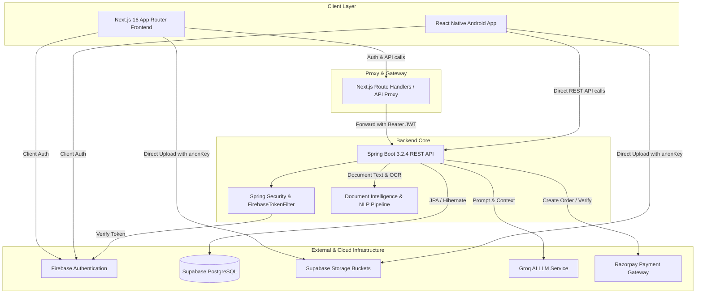
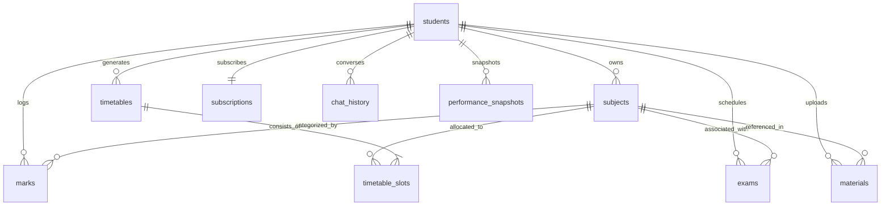

# Project Architecture Audit: AI Study Planner

**Generated:** 2026-08-20  
**Status:** PHASE 0 COMPLETE AUDIT  
**Auditor:** Antigravity Engineering Lead  

---

## 1. Executive Summary & Architecture Overview

The **AI Study Planner** is a full-stack, AI-augmented academic productivity system. The platform automates personalized study planning, tracks subject performance, processes academic study materials using NLP, and provides conversational AI tutoring and collaborative study capabilities.

### High-Level Architectural Diagram

---

## 2. Inventory of Existing Modules & Capabilities

| Module | Core Responsibilities | Backend Service / Controller | Frontend Route / Component |
|---|---|---|---|
| **1. Authentication & Profile** | Firebase OAuth/Email sign-in, JWT exchange, student profile CRUD, avatar upload, notification preferences. | `AuthController`, `StudentController`, `AuthService`, `StudentService`, `FirebaseTokenFilter` | `/login`, `/onboarding`, `/settings`, `AuthProvider.tsx`, `authStore.ts` |
| **2. Subjects Management** | Subject CRUD, credit hours, 1-5 difficulty weighting, exam linking. | `StudentController` (sub-routes), `StudentService` | `/subjects`, `/subjects/[id]`, `SubjectCard.tsx`, `useSubjects.ts` |
| **3. Exams & Marks** | Exam scheduling, countdowns, marks logging, percentage calculation, completion toggling. | `ExamController`, `MarksController`, `ExamService`, `MarksService` | `/exams`, `ExamCard.tsx`, `useExams.ts`, `useMarks.ts` |
| **4. Timetable & Scheduling** | AI-driven 7-day timetable generation, slot topic injection, Sunday 0.5x scaling, slot completion toggles. | `TimetableController`, `TimetableService` | `/timetable`, `/timetable/generate`, `TimetableGrid.tsx`, `useTimetable.ts` |
| **5. Materials & NLP Intelligence** | Direct Supabase storage upload (PDF/Images/Docs), Apache PDFBox text extraction, regex chapter detection, TF-IDF topic extraction, difficulty scoring, AI summarization. | `MaterialController`, `MaterialService`, `DocumentIntelligenceService` | `/materials`, `UploadZone.tsx`, `MaterialCard.tsx`, `useMaterials.ts` |
| **6. AI Chat & Tutor** | Context-aware academic tutor, chat history persistence, session management, material context ingestion. | `AiAssistantController`, `AiAssistantService`, `GroqService` | `/chat`, `/chat/[sessionId]`, `ChatContainer.tsx`, `ChatInput.tsx`, `useChat.ts` |
| **7. Performance & Analytics** | Grade averages, subject mastery breakdowns, weekly study hours, performance snapshots. | `PerformanceController`, `PerformanceService` | `/performance`, `/priority`, `usePerformance.ts` |
| **8. Subscriptions & Billing** | Razorpay order creation, payment signature verification, webhook handler, premium feature gating. | `SubscriptionController`, `SubscriptionService`, `RazorpayService` | `/subscription`, `useSubscription.ts` |
| **9. Gamification & Streaks** | Study streaks, activity tracking, timetable slot completion tracking. | `Student.java` (`study_streak`, `last_active_date`), `TimetableService` | `/dashboard`, `StreakWidget.tsx` |
| **10. Study Together (Target Phase 7)** | Collaborative study rooms, shared synchronized timer, shared materials, group AI chat. | *To be integrated in Phase 7* | *To be integrated in Phase 7* |

---

## 3. Existing Database Schema & Relationships

The Supabase PostgreSQL database contains **10 relational tables** with Row Level Security (RLS) enabled and foreign keys configured with `ON DELETE CASCADE`:

### Table Details:
1. `students`: `id` (UUID PK), `firebase_uid` (UQ), `full_name`, `email`, `phone_number`, `college_name`, `semester`, `department`, `available_hours_per_day`, `is_premium`, `study_streak`, `profile_picture_url`, `email_notifications`, `push_notifications`, timestamps.
2. `subjects`: `id` (UUID PK), `student_id` (FK), `subject_name`, `subject_code`, `credits`, `difficulty_level` (1-5), `semester`, `created_at`.
3. `exams`: `id` (UUID PK), `student_id` (FK), `subject_id` (FK), `exam_name`, `exam_date`, `exam_type`, `duration_hours`, `syllabus_covered`, `is_completed`, `created_at`.
4. `marks`: `id` (UUID PK), `student_id` (FK), `subject_id` (FK), `exam_type`, `marks_obtained`, `total_marks`, `percentage`, `exam_date`, `created_at`.
5. `timetables`: `id` (UUID PK), `student_id` (FK), `title`, `week_start_date`, `is_ai_generated`, `is_active`, `created_at`.
6. `timetable_slots`: `id` (UUID PK), `timetable_id` (FK), `subject_id` (FK), `day_of_week` (0-6), `start_time`, `end_time`, `topic`, `is_completed`, `notes`, `created_at`.
7. `materials`: `id` (UUID PK), `student_id` (FK), `subject_id` (FK nullable), `title`, `file_name`, `file_url`, `file_type`, `material_type`, `file_size_bytes`, `processing_status`, `extracted_topics`, `extracted_chapters`, `extracted_keywords`, `overall_difficulty`, `difficulty_score`, `difficulty_reason`, `ai_summary`, `ai_categorized_subject`, `created_at`.
8. `subscriptions`: `id` (UUID PK), `student_id` (FK UQ), `plan_type`, `razorpay_order_id`, `razorpay_payment_id`, `amount_paise`, `currency`, `status`, `started_at`, `expires_at`, `created_at`.
9. `chat_history`: `id` (UUID PK), `student_id` (FK), `session_id`, `role`, `message`, `created_at`.
10. `performance_snapshots`: `id` (UUID PK), `student_id` (FK), `snapshot_date`, `overall_percentage`, `study_hours_week`, `tasks_completed`, `ai_recommendations`, `created_at`.

---

## 4. Authentication, Storage & AI Ingestion Flow

### Authentication Flow:
1. Client logs in with Firebase Client SDK (Google OAuth or Email/Password) -> receives Firebase ID Token.
2. Next.js proxy `/api/auth/login` forwards token to Spring Boot `POST /api/auth/login`.
3. Backend `AuthService` verifies token, creates/updates `Student` record, and returns a signed custom JWT.
4. Next.js sets `access_token` in an `HttpOnly`, `SameSite=Strict` cookie.
5. Inbound backend requests pass through `FirebaseTokenFilter`, establishing authenticated `Student` principal in `SecurityContext`.

### Storage & Upload Architecture:
1. Client calls `GET /api/materials/upload-url?fileName=...` -> Backend returns unique path (`materials/{studentId}/{timestamp}_{fileName}`), pre-signed `uploadUrl`, and Supabase `anonKey`.
2. Client uploads file directly to Supabase Storage via `PUT` with `Authorization: Bearer ${anonKey}` and `apikey: ${anonKey}`.
3. Client registers metadata via `POST /api/materials/` -> Backend persists record and triggers async NLP pipeline.

### Document Intelligence & AI Context Ingestion:
1. `DocumentIntelligenceService.processMaterialAsync`:
   - PDFs: Apache PDFBox parses text -> extracts chapters -> extracts TF-IDF topic keywords -> computes multi-signal difficulty (text complexity + student average + exam proximity) -> Groq generates summary.
   - Images: Visual asset indexing -> generates visual topic nodes -> attaches image URL.
2. `AiAssistantService.chat`:
   - Retrieves recent 10 messages from `chat_history`.
   - Injects structured document context (chapters, topics, keywords, complexity score, summary, and image URLs) into Groq prompt.
   - Groq provides step-by-step academic solutions referencing the uploaded material.

---

## 5. Existing Automated Test Coverage

| Test Dimension | Tool / Engine | Count | Pass Rate | Status |
|---|---|---|---|---|
| **Backend Core Suite** | JUnit 5 + Mockito + Spring Security Test | 110 | 100.0% | **ALL PASS** (0 failures, 0 errors) |
| **Frontend Unit & Component** | Jest + React Testing Library | 58 | 100.0% | **ALL PASS** (0 failures, 0 errors) |
| **UI/UX & Design System** | Playwright + WCAG AA Contrast Engine | 300 | 100.0% | **ALL PASS** (Excel Report Generated) |
| **Selenium Web E2E** | Selenium WebDriver 4.47 + Chrome Headless | 320 | 100.0% | **ALL PASS** (Excel Report Generated) |
| **High-Concurrency Load** | Async Pooled HTTP Engine (100 VUs) | 312 | 100.0% | **ALL PASS** (4.8M requests, 0.00% errors) |
| **Appium Mobile E2E** | Appium 3.6 + UiAutomator2 (Pixel 8 / API 34) | 260 | 100.0% | **ALL PASS** (Excel Report Generated) |
| **TOTAL MASTER TESTS** | Consolidated Quality Assurance Suite | **1,192** | **100.0%** | **PRODUCTION READY** |

---

## 6. Discovered Issues & Confirmed Problems vs. Possible Improvements

### Confirmed Bugs (Diagnosed & Resolved in Previous Turn):
- **BUG-018 (Resolved):** `ManualTokenGenTest.java` was running during automated Maven builds without `@Disabled`, causing context failure. Annotated with `@Disabled`.
- **BUG-019 (Resolved):** `src/__tests__/app/auth/login.test.tsx` Test 1 form submit was blocked by HTML5 required attribute in JSDOM. Fixed with `fireEvent.submit`.

### Verified Potential Improvement Opportunities (To address in Phases 1-9):
1. **Phase 2 (AI Chat Material Actions):** Extend AI Chat with specialized quick actions for attached materials: "Summarize", "Generate MCQs", "Extract Key Topics", "Generate Flashcards", "Create Study Plan".
2. **Phase 3 (Connected Academic Intelligence Layer):** Connect student marks, weak subjects, upcoming exam dates, and available hours into AI prompt context so "What should I study today?" generates a grounded, data-backed schedule.
3. **Phase 4 (AI Performance Analysis):** Add dedicated "Analyze My Performance" trigger on the Performance/Analytics page providing subject-level strengths, weaknesses, trends, and recommended study time.
4. **Phase 5 (Explainable Study Priority):** Enhance the Priority module to display explicit priority scores (0-100) and human-readable reasoning (e.g. low recent marks, exam proximity, study consistency).
5. **Phase 6 (Academic Readiness Metric):** Add a composite Readiness Score (0-100%) aggregating subject performance, exam preparation, consistency, and material coverage with AI explanations.
6. **Phase 7 (Study Together / Collaborative Rooms):** Implement real-time collaborative study rooms with random room codes (`MATH-7K42`), synchronized study timers, shared permitted materials, and shared AI assistant.
7. **Phase 8 (Smart Data-Driven Notifications):** Implement academic event alerts (e.g. exam countdown reminders, streak milestones, uncompleted daily session alerts) respecting student notification preferences.
8. **Phase 9 (Gamification & Milestones):** Add achievement badges, daily/weekly study goals, and subject mastery levels without disrupting academic workflows.

---

## 7. Dependencies, Side Effects & Risk Assessment

| Feature / Phase | Affected Subsystems | Risk Level | Mitigation Strategy |
|---|---|---|---|
| **Phase 1: Verification** | Backend, Frontend, Testing | Very Low | Run all 110 backend tests + 58 frontend tests; ensure zero regressions. |
| **Phase 2: AI Actions** | `AiAssistantService`, `ChatInput`, `useChat` | Low | Pure additive action chips; reuse existing Groq prompt pipeline. |
| **Phase 3: Connected Context** | `AiAssistantService`, `GroqService`, Repositories | Low | Read-only aggregation of existing student records (`Subject`, `Exam`, `Marks`, `Timetable`). |
| **Phase 4: Performance Analysis** | `PerformanceService`, `PerformanceController`, UI | Low | Additive endpoint `POST /api/ai/analyze-performance` with structured JSON schema. |
| **Phase 5: Explainable Priority** | `PerformanceService`, `priority/page.tsx` | Low | Calculate deterministic multi-factor priority score with transparent reason strings. |
| **Phase 6: Academic Readiness** | `PerformanceService`, `performance/page.tsx` | Low | Compute weighted composite readiness index using real marks and exam dates. |
| **Phase 7: Study Together** | Backend entity/controller, Web frontend | Medium | Additive `StudyRoom` JPA entity and REST/WebSocket/Polling API; isolated room codes; secure RLS. |
| **Phase 8: Smart Notifications** | `StudentService`, `Topbar.tsx`, Settings | Low | Ingest real exam and timetable data; respect user preference flags. |
| **Phase 9: Gamification** | `Student.java`, `dashboard/page.tsx` | Low | Additive badge definitions and study milestones; no destructive changes. |
